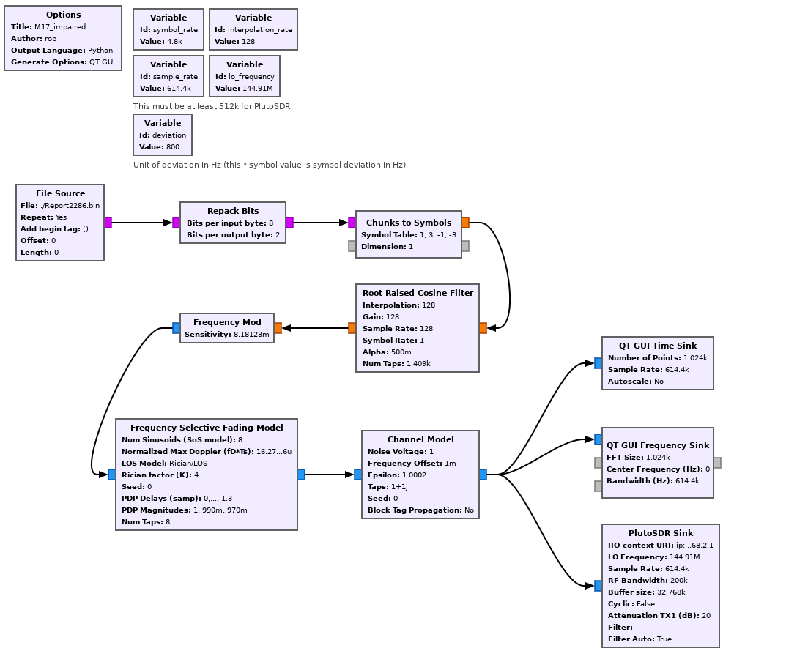
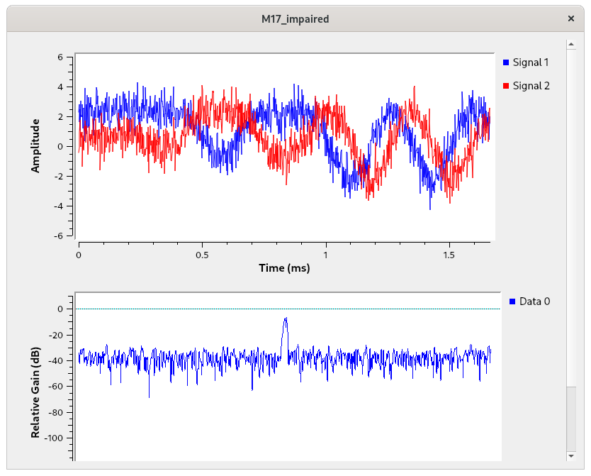
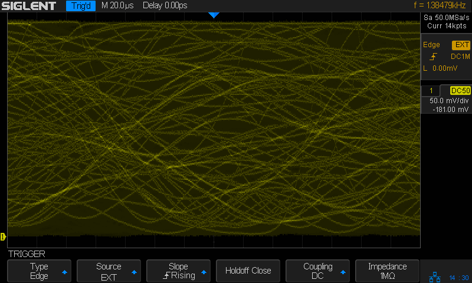

# M17 Gnu Radio Testing

This is a quick 4-FSK flow graph for M17 RF transmit.

Source is a file of M17 type 4 data.

Sink is an ADALM Pluto SDR.

Modify source and sink to suit one's needs.

## Impairment Testing

`M17_impaired.grc` and `M17_impaired.py` an M17 impairment test.  It can
implement Rayleigh or Rician fading models, AWGN, frequency errors, and
timing errors.

Before running this test one should calibrate the transmitter and receiver
so that the transmit and recieve frequencies are precisely aligned.

Adjust the `lo_frequency` variable to the desired transmit frequency.

Replace the sink with whatever is appropriate for your TX hardware.

This uses a rather long audio program to test the receiver.

The impairments can get pretty severe.  This is what a *typical* 
eye diagram of the received baseband signal looks like.

## HackRF Flow Graphs

There are two enhanced flow graphs for HackRF. I use the HackRF for
test more these days because it allows me to feed a 10MHz reference
from my GPSDO for accurate frequency transmission.

The first is `m17-arn-hackrf.grc` which is used to transmit a long
form audio broadcast from Amateur Radio Newsline. There is a script,
`make_arn.sh`, which I use to create the bitstream using `m17-cxx-mod`r
which may need to be modified to suit specific needs (changing the
path to m17-cxx-mod or the name of the latest ARN MP3 file).

The second is `m17-bert-hackrf.grc` which is used to transmit a BER
test bitstream.

Both have GUI controls to change the following impairments:

 - AWGN -- this is a noise voltage level, with 2.0 begin 0dB.
 - Frequency -- this is a frequency offset in % of 800Hz symbol unit.
 - Clock -- this is the symbol clock offset in PPM.
 - Fading -- this enables or disables frequency selective fading model.

## Pluto Flow Graphs

There are two enhanced flow graphs for PlutoSDR. My Plutos have
been modified to have accurate TXCOs and so can be used as reasonable
reference units, but are not as accurate as a HackRF clocked by
a 10MHz GPSDO reference.

These are similar to the enhanced HackRF flow graphs described above.

## Making the AR Newsline Bitstream

We do not ship the AR Newsline bitstream because the content is
owned by *Amateur Radio Newsline* and I do not have permission to
distribute it.

There are two steps to making an AR Newsline M17 bitstream file. The
first step is to go to the AR Newsline web site and download the
latest MP3 file. https://www.arnewsline.org/

The second is to use `ffmpeg` to transform the MP3 to PCM and
use `m17-cxx-mod` to convert it to a bitstream.

    ffmpeg -i Report2328.mp3 -ar 8000 -ac 1 -f s16le -acodec pcm_s16le - | ~/m17-cxx-demod/build/apps/m17-mod -b -S M17 > Report2328.bin

There is a script, `make_arn.sh` which can be modified to automate
the process for you.

